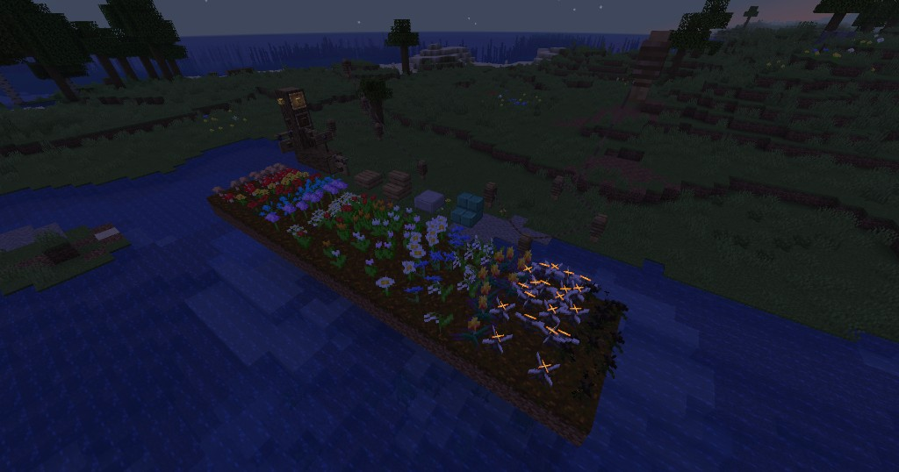
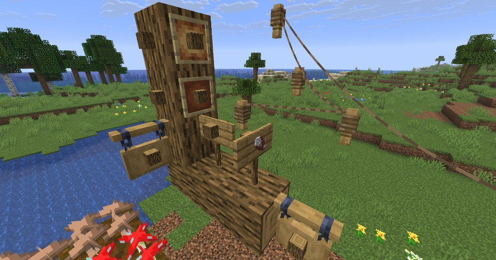
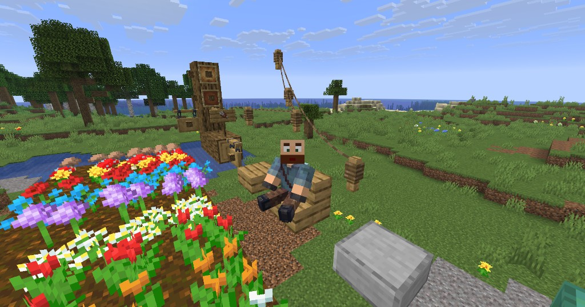
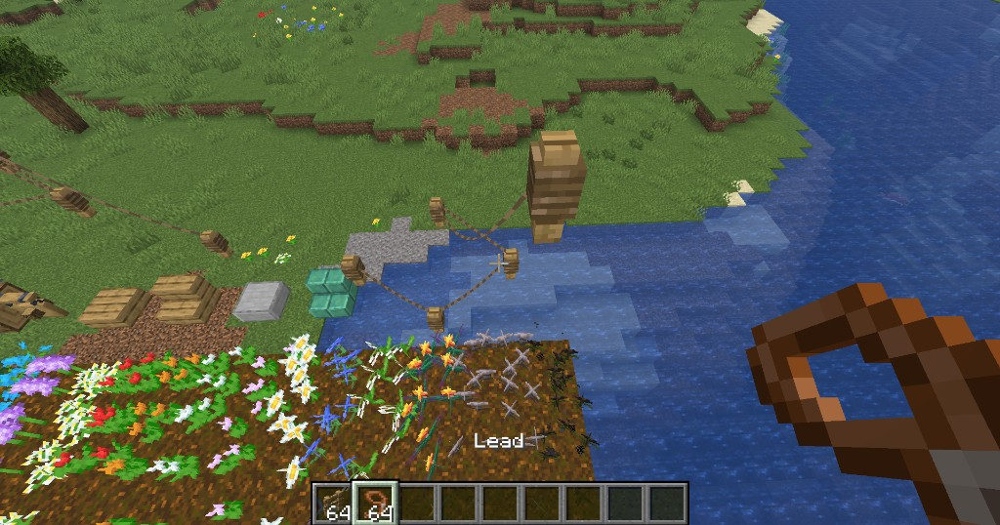
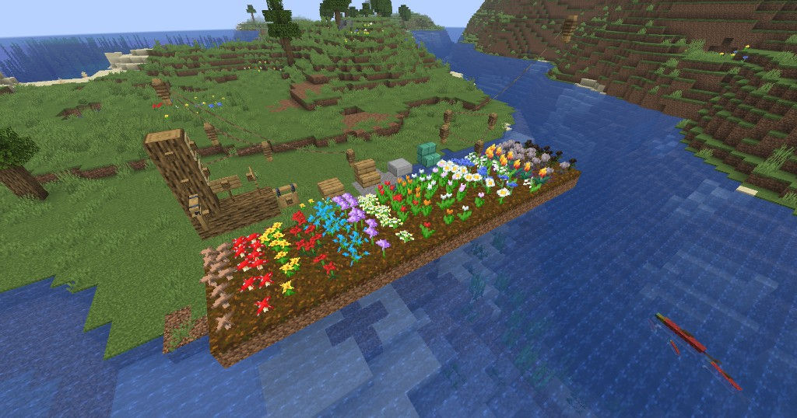

<p align="center">
  
</p>

# Vanilla Plus Accents

Small vanilla-friendly quality-of-life accents for Minecraft **Java Edition 26.1.2** (Fabric).



## Features

### Invisible item frames & sign displays

Shear an item frame to hide the wooden backing (shear again to show it). Place any item on an empty sign the same way you would an item frame; empty-hand click removes it.



### Fence-to-fence leads

Connect fences with leads for decorative rope lines:

1. Right-click a fence with a **lead** to anchor (consumes one lead; rope follows you)
2. Right-click a second fence within **16 blocks** to connect (empty hand is fine while pending)
3. Right-click the same fence again while pending to cancel and refund
4. Empty hand on a **knot** picks up all links on that post
5. Breaking a linked fence removes its connections — survival returns leads to inventory; creative drops them as items at the break

A fence can hold many links. New ropes only start when you click with a lead again.





### Sitting & piggyback

- **Sit:** empty hand + Shift+right-click a slab or stair (needs 2 blocks of headroom). Shift again to stand.
- **Piggyback:** Ctrl+Shift+right-click another player to ride on their shoulders.

### Flower patches

Stack matching small flowers or mushrooms up to **4 per block** with natural askew placement. Bonemeal a single plant to start a patch of 2.



## Requirements

| | |
|---|---|
| Minecraft | **26.1.2** |
| Fabric Loader | **0.19.2+** |
| Fabric API | **0.149.0+26.1.2** |
| Java | **25** |

## Install

1. Install [Fabric Loader](https://fabricmc.net/use/installer/) for Minecraft 26.1.2
2. Drop [Fabric API](https://modrinth.com/mod/fabric-api) into your `mods` folder
3. Drop the release jar from [`jars/`](jars/) into `mods`

Current release: [`jars/vanillaplusaccents-1.0.0-Minecraft26.1.2.jar`](jars/vanillaplusaccents-1.0.0-Minecraft26.1.2.jar)

## Build

```powershell
./gradlew build
```

Output: `build/libs/vanillaplusaccents-1.0.0-Minecraft26.1.2.jar`

Copy a release into `jars/` when publishing:

```powershell
Copy-Item build\libs\vanillaplusaccents-1.0.0-Minecraft26.1.2.jar jars\ -Force
```

## License

[CC0-1.0](LICENSE) — public domain dedication.
