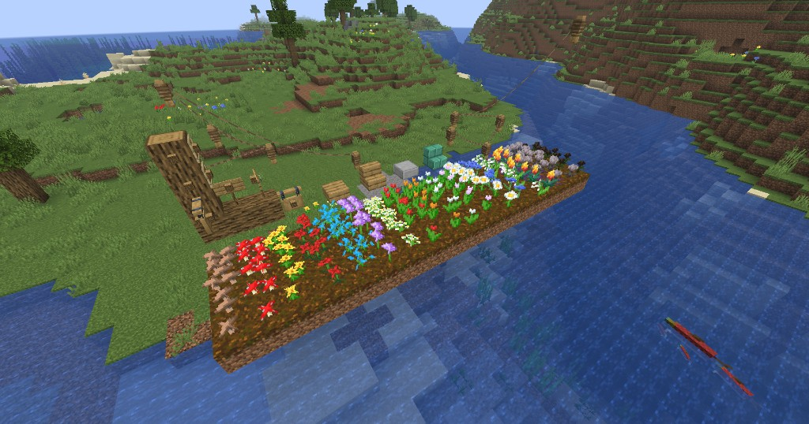
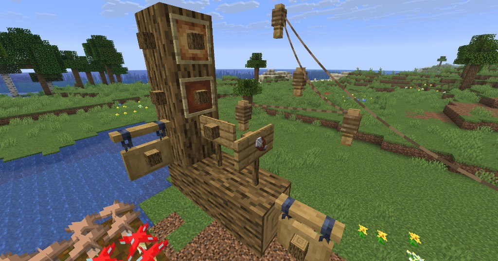
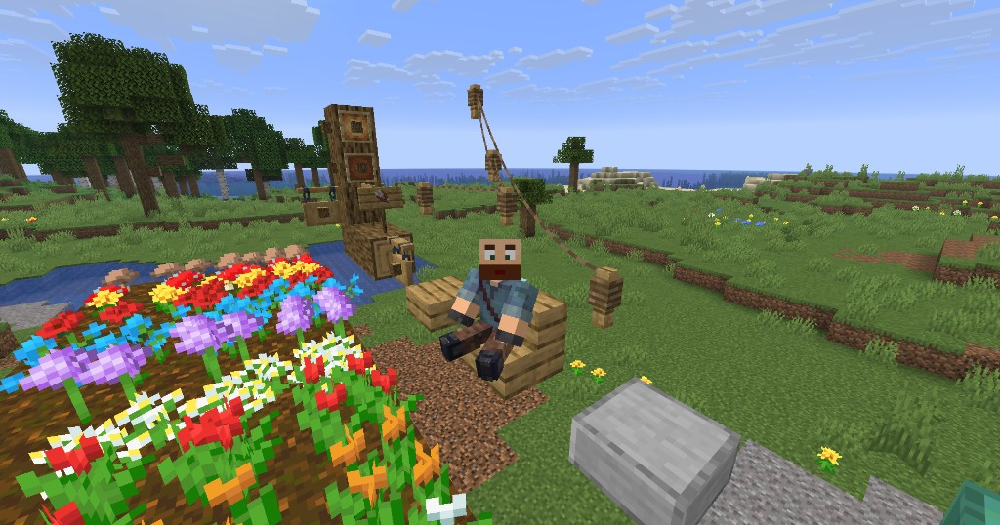
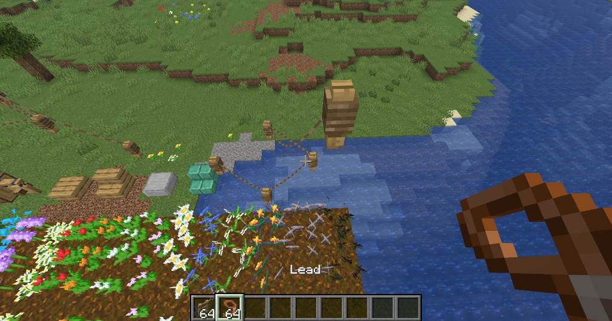
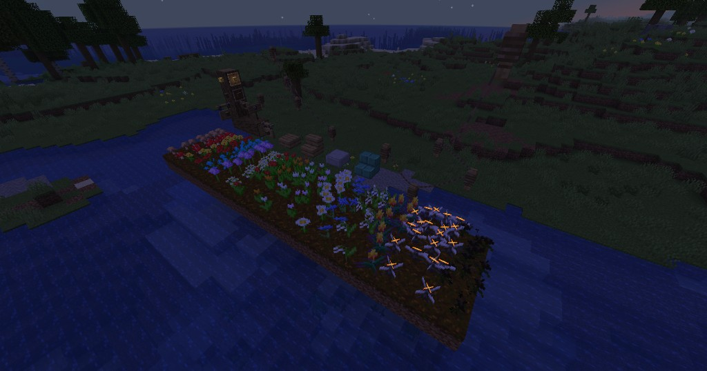

<p align="center">
  
</p>

# Vanilla Plus Accents

Small vanilla-friendly quality-of-life accents for Minecraft **Java Edition 26.1.2** (Fabric). Sitting on slabs and upright stairs is still included (cushions are a later 26.3 idea, not this release).



## 1.0.5

- Fence-to-fence leads persist across save/rejoin, use the vanilla leash look and sag, and attach about **55%** up the post.
- Empty-hand **regrab** on a hub takes this end of every spoke; far posts stay. One dest click reties the bundle. Clicking the original hub reties rather than refunds. Spans that are too far refund leftover leads through vanilla `inventory.add`.
- Breaking a linked fence drops its leads.
- Invisible item frames (sneak + shears) persist after reload.
- Signs display items, including **other signs**, without opening the text editor.
- Flower patches: bonemeal past 4 drops an extra flower like petals; **wither rose does not** duplicate.
- Stonecutter woodcutting yields from 1 log/wood/stripped are listed below.

## Features

### Invisible item frames & sign displays

Sneak + shear an item frame to hide the wooden backing (sneak + shear again to show it). A normal right-click with shears on an empty frame places the shears. Hidden frames stay hidden after reload. Place any item on an empty sign the same way you would an item frame — including another sign item, which displays instead of opening the editor. Empty-hand click removes the displayed item.



### Fence-to-fence leads

Connect fences with leads for decorative rope lines. Completed spans use the same vanilla leash look and sag as an animal on a knot, attach about **55%** up the post, and stay saved across save/rejoin:

1. Right-click a fence while **leading a mob** to hitch that animal (vanilla). Extra leads in hand do not start a rope.
2. Right-click a fence with a **lead** (not leading a mob) to anchor (consumes one lead; rope follows you)
3. Right-click a second fence within **16 blocks** to connect (empty hand is fine while pending)
4. Empty-hand **regrab** on a linked hub takes this end of every spoke; far posts stay. One dest click reties the whole bundle. Clicking the original hub reties rather than refunds.
5. Spans that are too far after a dest click refund leftover leads through vanilla inventory add (overflow drops)
6. **Shears** on a fence or knot drop every fence-to-fence lead on that post (animals use vanilla shear)
7. Breaking a linked fence removes its connections and drops the leads as items at the break

A fence can hold many links. New ropes only start when you click with a lead again.





### Sitting & piggyback

- **Sit:** empty hand + Shift+right-click a slab or upright stair (needs 2 blocks of headroom). Upside-down stairs are not seats. Shift again to stand.
- **Piggyback:** empty hand + Ctrl+Shift+right-click another player to ride on their shoulders. Release Shift once after mounting, then Shift again to dismount. **Stacks:** a player who already has someone on their back can still mount another player (A on B, then B mounts C), and others can mount the top of a stack (C mounts A).

### Flower patches

Stack matching small flowers or mushrooms up to **4 per block** with natural askew placement. Bonemeal a single plant to start a patch of 2. Bonemeal a full patch of 4 drops one extra flower item, like pink petals. **Wither rose** patches do not duplicate from bonemeal.



### Enderman & creeper grief

World-wide toggles (overworld SavedData). Defaults match vanilla (grief **ON**).

| Setting | Default | Behavior |
|---------|---------|----------|
| `enderman_grief` | ON | OFF blocks Enderman block pickup and place |
| `creeper_grief` | ON | OFF keeps blast damage/knockback but does not break blocks |

```
/vanillaplusaccents enderman_grief [true|false]
/vanillaplusaccents creeper_grief [true|false]
```

Omit `true`/`false` to flip the current value.

### Dirt path & mud speed

All speed factors share the same clamp: **0.5–2.0** (`1.0` = normal).

| Setting | Default | Behavior |
|---------|---------|----------|
| `path_speed` | **1.5** | Relative move speed on dirt paths; while on path you also **step up full blocks** like slabs |
| `mud_speed` | **0.9** | Relative move speed on mud |

```
/vanillaplusaccents path_speed [0.5-2.0]
/vanillaplusaccents mud_speed [0.5-2.0]
```

Omit the value to show the current setting.

### Happy Ghast ride speed

Relative fly speed while a player is controlling a Happy Ghast (`1.0` = vanilla). Same clamp as path/mud.

| Setting | Default | Range |
|---------|---------|-------|
| `happy_ghast_speed` | **1.5** | **0.5–2.0** |

```
/vanillaplusaccents happy_ghast_speed [0.5-2.0]
```

Omit the value to show the current setting.

### Stonecutter woodcutting

The stonecutter also acts as a woodcutter for **vanilla and most modded woods**. Same-family only. From **1 log / wood / stripped**:

| Output | Rate |
|--------|------|
| Stripped / wood swap | 1 → 1 |
| Planks | 1 → 4 |
| Slabs | 1 → 9 |
| Stairs | 1 → 3 |
| Sticks | 1 → 9 |
| Fence | 1 → 3 |
| Fence gate | 1 → 1 |
| Trapdoor | 1 → 2 |
| Door | 1 → 2 |
| Sign | 1 → 2 |
| Shelf | 1 → 1 |
| Pressure plate | 1 → 2 |

From **1 plank**: slabs 2, stairs 1, sticks 2. Where a 1-in recipe exists: **1 slab → 1 stick**; **1 stair → 3 slabs, 3 sticks**. Two-in conversions (2 slabs = 1 plank, 2 stairs = 3 planks) are not stonecutter recipes.

Recipes are generated at load time from **item id conventions** in each mod’s namespace (e.g. `mymod:willow_log` + `mymod:stripped_willow_log` + `mymod:willow_planks` + stairs/slab/fence/fence gate). Woods that use nonstandard names won’t be picked up automatically.

## Commands

Requires **gamemaster** permission for settings (help is available to everyone). Root: `/vanillaplusaccents` (alias `/vpa`).

```
/vanillaplusaccents help
/vanillaplusaccents enderman_grief [true|false]
/vanillaplusaccents creeper_grief [true|false]
/vanillaplusaccents path_speed [0.5-2.0]
/vanillaplusaccents mud_speed [0.5-2.0]
/vanillaplusaccents happy_ghast_speed [0.5-2.0]
```

| Command | Args | Default | Notes |
|---------|------|---------|-------|
| `help` | — | — | Prints settings cheat-sheet |
| `enderman_grief` | `[true\|false]` | ON | Omit arg to flip |
| `creeper_grief` | `[true\|false]` | ON | Omit arg to flip |
| `path_speed` | `[0.5–2.0]` | 1.5 | Omit arg to show; on path also steps up full blocks |
| `mud_speed` | `[0.5–2.0]` | 0.9 | Omit arg to show current factor |
| `happy_ghast_speed` | `[0.5–2.0]` | 1.5 | Omit arg to show current factor |

All operator settings are world-wide (shared across dimensions via overworld SavedData).

## Requirements

| | |
|---|---|
| Minecraft | **26.1.2** |
| Fabric Loader | **0.19.2+** |
| Fabric API | **0.149.0+26.1.2** |
| Java | **25** |

## Install

1. Install [Fabric Loader](https://fabricmc.net/use/installer/) for Minecraft 26.1.2
2. Drop [Fabric API](https://modrinth.com/mod/fabric-api) into your `mods` folder
3. Drop the release jar from [`jars/`](jars/) into `mods`

Current release: [`jars/vanillaplusaccents-1.0.5-Minecraft26.1.2.jar`](jars/vanillaplusaccents-1.0.5-Minecraft26.1.2.jar)

## Build

```powershell
./gradlew build
```

Output: `build/libs/vanillaplusaccents-1.0.5-Minecraft26.1.2.jar`

Copy a release into `jars/` when publishing:

```powershell
Copy-Item build\libs\vanillaplusaccents-1.0.5-Minecraft26.1.2.jar jars\ -Force
```

## Development

- **Woodcutting:** recipes are generated in code (`WoodcuttingRecipes`) from item-id conventions when the recipe manager reloads — no per-wood JSON required.

## License

[CC0-1.0](LICENSE) — public domain dedication.

## Repository

Source: [github.com/marcosdherrero/VanillaPlusAccents](https://github.com/marcosdherrero/VanillaPlusAccents)
