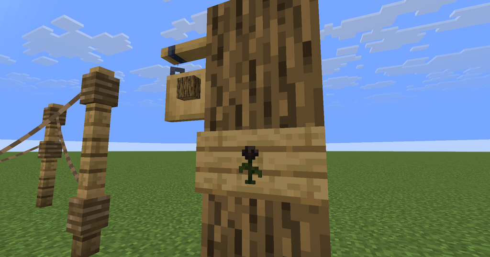
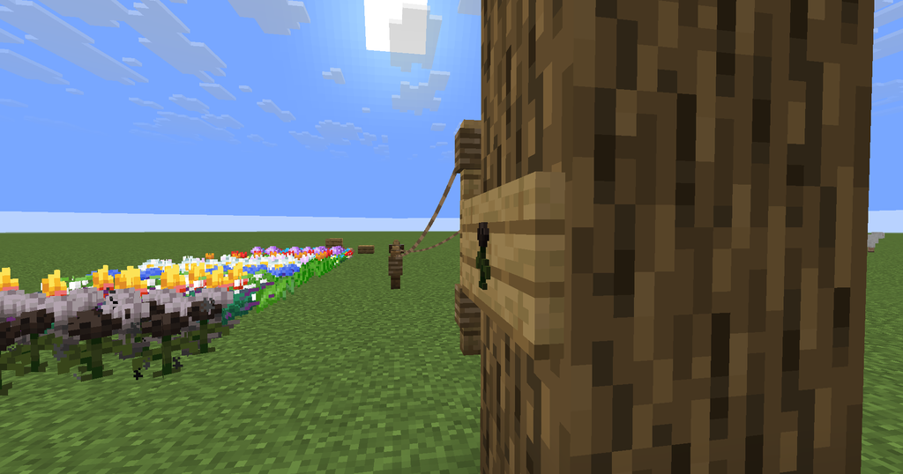
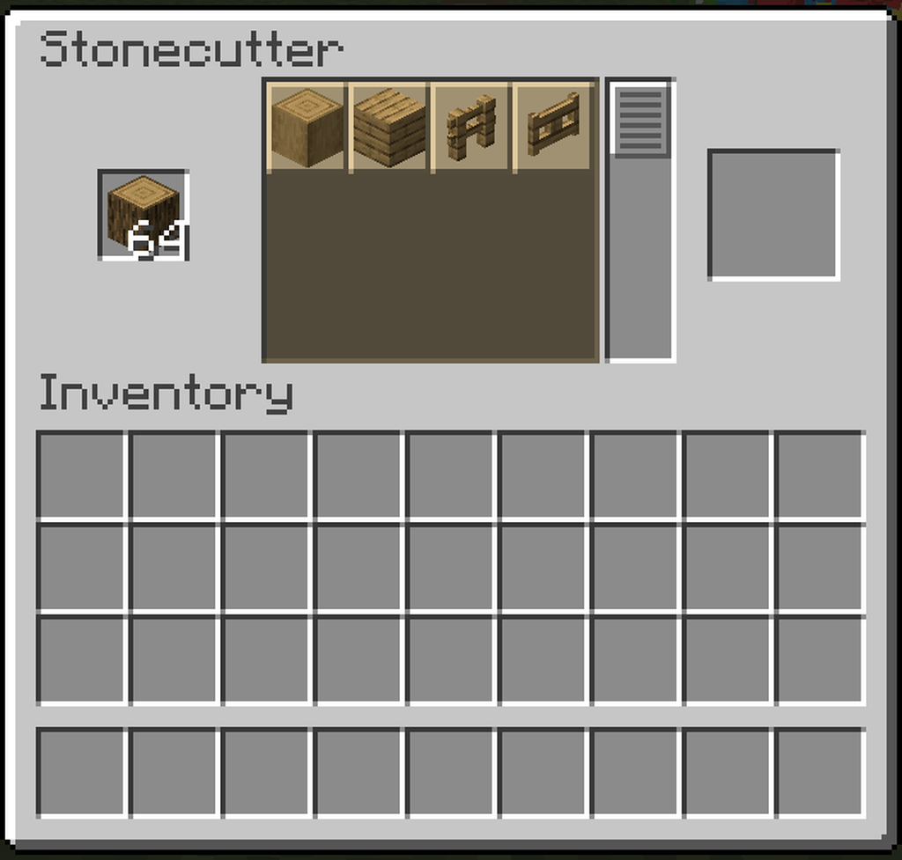
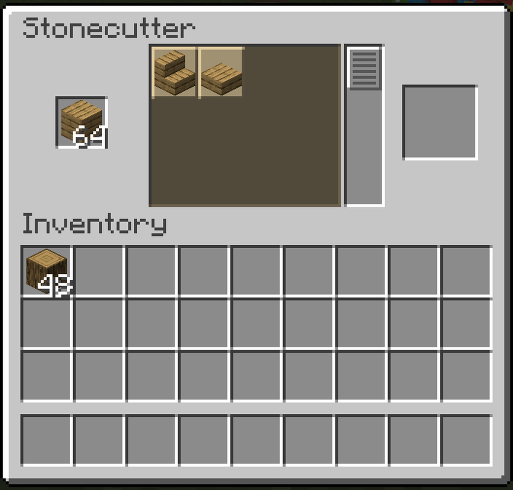

<p align="center">
  
</p>

# Vanilla Plus Accents

Small vanilla-friendly quality-of-life accents for Minecraft **Java Edition 26.2** (Fabric). Player and developer notes for each version: [Changelog](CHANGELOG.md).


## Features

### Invisible item frames & sign displays

Shear an item frame to hide the wooden backing (shear again to show it). Place any item on an empty sign the same way you would an item frame; empty-hand click removes it. Displayed items sit **flush on the sign face** (standing, wall, and hanging signs).






### Fence-to-fence leads

Connect fences with leads for decorative rope lines. Completed spans droop as catenaries and use the **same rib spacing** as a lead on an animal:

1. Right-click a fence while **leading a mob** to hitch that animal (vanilla). Extra leads in hand do not start a rope.
2. Right-click a fence with a **lead** (not leading a mob) to anchor (consumes one lead; rope follows you)
3. Right-click a second fence within **16 blocks** to connect (empty hand is fine while pending)
4. Right-click the same fence again while pending to cancel and refund
5. Empty hand on a **knot** picks up all links on that post
6. **Shears** on a fence or knot drop every fence-to-fence lead on that post (animals use vanilla shear)
7. Breaking a linked fence removes its connections — survival returns leads to inventory; creative drops them as items at the break

A fence can hold many links. New ropes only start when you click with a lead again.


### Sitting & piggyback

- **Sit:** empty hand + Shift+right-click a slab or upright stair (needs 2 blocks of headroom). Upside-down stairs are not seats. Shift again to stand.
- **Piggyback:** empty hand + Ctrl+Shift+right-click another player to ride on their shoulders. Release Shift once after mounting, then Shift again to dismount. **Stacks:** a player who already has someone on their back can still mount another player (A on B, then B mounts C), and others can mount the top of a stack (C mounts A).

### Flower patches

Stack matching small flowers or mushrooms up to **4 per block**. Models stay **vanilla size**; 2–4 stems are spaced so typical small flowers (poppies, dandelions, and similar) do not cover each other — three stay a triangle, four a quad. Petals may spill into neighboring blocks. Bonemeal a single plant to start a patch of 2.


### Enderman & creeper grief

World-wide toggles (overworld SavedData). Defaults match vanilla (grief **ON**).

| Setting | Default | Behavior |
|---------|---------|----------|
| `enderman_grief` | ON | OFF blocks Enderman block pickup and place |
| `creeper_grief` | ON | OFF keeps blast damage/knockback but does not break blocks |

```
/vanillaplusaccents enderman_grief [true|false]
/vanillaplusaccents creeper_grief [true|false]
```

Omit `true`/`false` to flip the current value.

### Dirt path & mud speed

All speed factors share the same clamp: **0.5–2.0** (`1.0` = normal).

| Setting | Default | Behavior |
|---------|---------|----------|
| `path_speed` | **1.5** | Relative move speed on dirt paths; while on path you also **step up full blocks** like slabs |
| `mud_speed` | **0.9** | Relative move speed on mud |

```
/vanillaplusaccents path_speed [0.5-2.0]
/vanillaplusaccents mud_speed [0.5-2.0]
```

Omit the value to show the current setting.

### Happy Ghast ride speed

Relative fly speed while a player is controlling a Happy Ghast (`1.0` = vanilla). Same clamp as path/mud.

| Setting | Default | Range |
|---------|---------|-------|
| `happy_ghast_speed` | **1.5** | **0.5–2.0** |

```
/vanillaplusaccents happy_ghast_speed [0.5-2.0]
```

Omit the value to show the current setting.

### Wood / stone cutter

The vanilla stonecutter also acts as a woodcutter for **vanilla and most modded woods**:





| Input | Output | Rate |
|-------|--------|------|
| Log / wood / stem / hyphae / bamboo block | Stripped variant | 1 → 1 |
| Those blocks (including stripped) | Matching planks | 1 → 4 |
| Those blocks (including stripped) | Matching fence | 1 → 1 |
| Those blocks (including stripped) | Matching fence gate | 1 → 1 |
| Planks | Stairs | 1 → 1 |
| Planks | Slabs | 1 → 2 |

Recipes are generated at load time from **item id conventions** in each mod’s namespace (e.g. `mymod:willow_log` + `mymod:stripped_willow_log` + `mymod:willow_planks` + stairs/slab/fence/fence gate). Woods that use nonstandard names won’t be picked up automatically.

## Commands

Requires **gamemaster** permission for settings (help is available to everyone). Root: `/vanillaplusaccents` (alias `/vpa`).

```
/vanillaplusaccents help
/vanillaplusaccents enderman_grief [true|false]
/vanillaplusaccents creeper_grief [true|false]
/vanillaplusaccents path_speed [0.5-2.0]
/vanillaplusaccents mud_speed [0.5-2.0]
/vanillaplusaccents happy_ghast_speed [0.5-2.0]
```

| Command | Args | Default | Notes |
|---------|------|---------|-------|
| `help` | — | — | Prints settings cheat-sheet |
| `enderman_grief` | `[true\|false]` | ON | Omit arg to flip |
| `creeper_grief` | `[true\|false]` | ON | Omit arg to flip |
| `path_speed` | `[0.5–2.0]` | 1.5 | Omit arg to show; on path also steps up full blocks |
| `mud_speed` | `[0.5–2.0]` | 0.9 | Omit arg to show current factor |
| `happy_ghast_speed` | `[0.5–2.0]` | 1.5 | Omit arg to show current factor |

All operator settings are world-wide (shared across dimensions via overworld SavedData).

## Requirements

| | |
|---|---|
| Minecraft | **26.2** |
| Fabric Loader | **0.19.3+** |
| Fabric API | **0.157.0+26.2** |
| Java | **25** |

## Install

1. Install [Fabric Loader](https://fabricmc.net/use/installer/) for Minecraft 26.2
2. Drop [Fabric API](https://modrinth.com/mod/fabric-api) into your `mods` folder
3. Drop the release jar from [`jars/`](jars/) into `mods`

Current release: [`jars/vanillaplusaccents-1.0.6-Minecraft26.2.jar`](jars/vanillaplusaccents-1.0.6-Minecraft26.2.jar)

## Build

```powershell
./gradlew build
```

Output: `build/libs/vanillaplusaccents-1.0.6-Minecraft26.2.jar`

Copy a release into `jars/` when publishing:

```powershell
Copy-Item build\libs\vanillaplusaccents-1.0.6-Minecraft26.2.jar jars\ -Force
```

## Development

- **Woodcutting:** recipes are generated in code (`WoodcuttingRecipes`) from item-id conventions when the recipe manager reloads — no per-wood JSON required.

## Changelog

What changed in 1.0.1–1.0.6 (fence-lead visibility, flush signs, flower spacing, hitching/catenaries, woodcutting, the 26.2 port) is in [CHANGELOG.md](CHANGELOG.md).

## License

[CC0-1.0](LICENSE) — public domain dedication.

## Repository

Source: [github.com/marcosdherrero/VanillaPlusAccents](https://github.com/marcosdherrero/VanillaPlusAccents)
